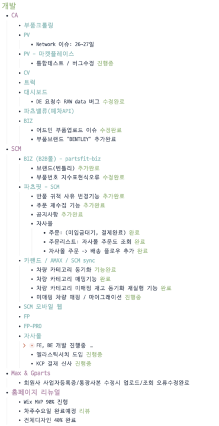
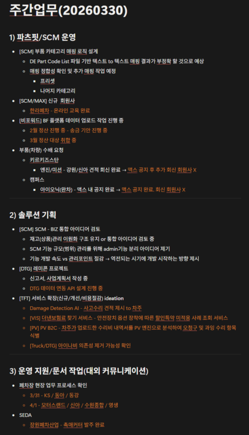
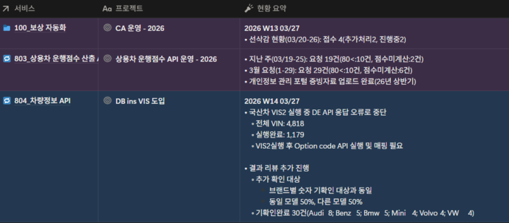
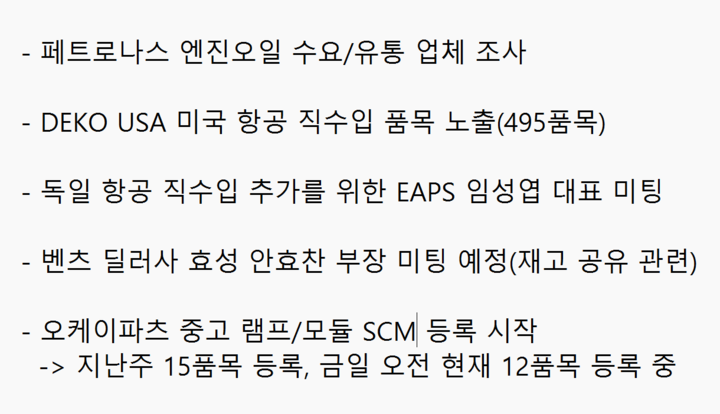

## 1. 부품 소싱 및 유통 (부품 사업)

- **엔진오일 공급 이슈:** 이란 전쟁 여파로 벤츠 엔진오일 공급 불발(약 1억 원 규모). 대안으로 페트로나스 엔진오일 수요 조사 및 유통업체 확보 추진 중
- **해외 직수입 확대:**
	- **미국(데코 USA):** 800여 개 품목 중 가격 경쟁력이 있는 490여 개 품목 플랫폼 노출 완료
	- **독일:** 항공 직수입 세팅을 위해 EAPS 대표 미팅 완료
- **재고:** 효성자동차(벤츠 딜러사)와 과잉 재고 공유 관련 미팅 예정
- **파츠핏 입점:** 오케이파츠의 중고 램프 및 모듈이 SCM에 본격 등록 시작

## 2. 운영 및 정산

- **지파츠 MAX:**
	- 한라폐차 가입 온라인 교육 완료
	- 비포워드 2월 주문 건 청구 완료 및 3월 정산 대상 취합 후 경영지원팀 전달 예정
- **부품 수배:** 현재 회원사 견적 등 추가 진전 사항 없음
- **폐차장 현장 업무 확인:** 2026.03.31 (월)\~2026.04.01 (화) 폐차장 방문 예정

## 3. 솔루션 기획

- **DTG 레미콘 프로젝트:** 신고서 및 사업 계획서 작성 중
- **DTG 트럭 비용 절감 아이디어:** 아이나비 트럭 유료 서비스 대체 검토. 국토부 공간 정보 데이터 시뮬레이션 결과 유사한 안전 정보 산출 가능 확인(DB손보와 협의 예정).
- **VIS 더낸 보험료 찾기:** \* **외산차:** VIS v1으로 약 1,000건 실행 완료 및 옵션 일치 여부 검증 중.
	- **국산차:** VIS v2 진행 중이나 API 응답 오류 발생하여 수정 후 재개 예정.
- **기타:** 대형 트럭 시뮬레이션 AI 수요 조사(서베이)를 위한 프론트 페이지 제작 준비, PB B2C 사업 계획 공유 예정.

## 4. 개발 현황

- **인프라 이슈:** MS 할당 IP 임의 변경으로 인한 네트워크 장애 복구 완료 및 정상화.
- **플랫폼 고도화:**
	- **비즈/SCM:** 벤틀리 브랜드 추가, 부품 업로드 및 지수 표현식 오류 수정, 반품 사유 변경 및 공지사항 기능 추가.
	- **자사몰:** 주문/배송 플로우 개발 및 차량 카테고리 매핑/동기화 기능 완료.
	- **화물(FPB):** 엘라스틱 서치 도입 및 KCP 결제 심사 진행.
- **홈페이지 리뉴얼:** MVP 기준 90% 진행, 이번 주 수요일 리뷰 예정(전체 디자인 40% 완료).

## 5. 경영지원 및 인사

- **결산 및 세무:** 2025년 원기 결산, 세무 조정, 정기 주주총회 결의 완료. 현재 2026년 1분기 결산 진행 중.
- **투자 및 증자:** 투자 계약 절차 완료에 따른 증자 등기 등 후속 절차 진행.
- **인사 발령:**
	- **신규 입사:** 2026.04.01 (수). 서홍일, 2026.04.06. (월) 김윤호, 2026.04.06. (월) 김재훈 파트장님
	- **조직 개편:** 조직 개편 및 복리후생 공지 확인 요망. 금일 오후 5시부터 부서장 주도하에 자리 이동 실시.

---

## 첨부 자료

**연구개발팀**

---

**제품운영1파트**

---

**제품운영2파트**

---

**영업파트**

