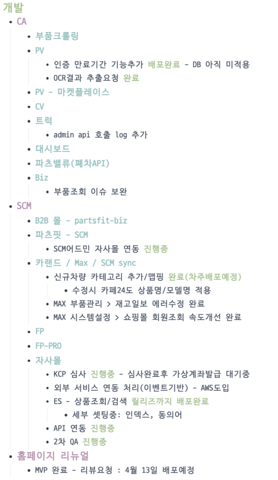
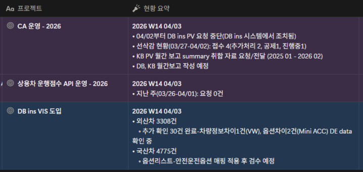
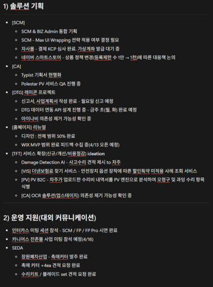
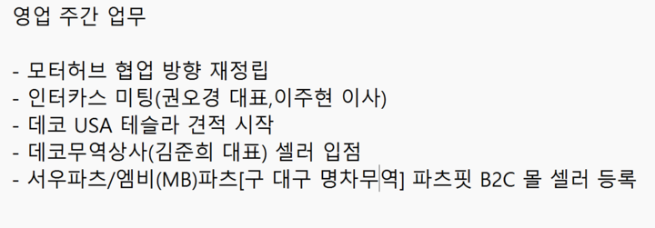

### 1. 물류 인프라 및 부품 유통 사업

- **물류 거점 확보:** 해외 수출 및 국내 유통을 위한 물류 인프라 구축이 시급한 상황입니다. 직접 운영의 부담을 줄이기 위해 외주 업체 섭외를 완료했으며, 내일(4월 7일) 최종 논의를 통해 운영 방안을 확정할 예정입니다.
- **사업 본격화:** 확보된 거점을 기반으로 부품 유통 사업을 전사적 핵심 과제로 추진합니다. 이를 위해 사업자등록증상에 '자동차 및 부품 수출입' 업태를 추가하는 정정 신고를 진행할 계획입니다.

### 2. FP Pro 고도화 및 유료 상용화 계획

- **시장 반응:** 수입차 부품 유통업체 '인터카스' 미팅 결과, FP Pro에 대한 긍정적인 시장성을 확인했습니다.
- **상용화 로드맵:** 2026년 말까지 유료화를 목표로 설정했습니다. 이를 위해 신임 파트장 주도하에 사용자 피드백 반영, 속도 개선, 필드 정합성 검증 등 고도화 작업을 진행합니다.
- **시스템 통합:** 향후 FP Pro와 B2B 몰을 연동하여 견적부터 발주까지 한 번에 처리할 수 있는 일괄 시스템을 구축할 예정입니다.

### 3. 신규 사업: 테슬라(Tesla) 부품 시장 진출

- **시장 기회:** 테슬라 차량 급증에도 불구하고 체계적인 발주 시스템을 갖춘 업체가 드문 점을 공략합니다.
- **전략 방향:** \* 주요 유통 업체의 B2B 몰 입점 영업을 시작합니다.
	- 내부 수요 데이터를 분석하여 고마진 품목을 선별, 위탁 창고에 재고를 선확보하여 직접 유통하는 방안을 추진합니다.
	- 해당 영역은 새로운 파트장이 입점, 수입, 재고 관리 전반을 총괄합니다.

### 4. 개발 및 기획 부문 현황

- **자사 플랫폼:** 자사몰 KCP 결제 심사가 완료되었으며 가상계좌 발급을 대기 중입니다. 네이버 스마트스토어는 정책 변화에 따라 효율이 높은 1,000개 품목을 선별하여 운영할 예정입니다.
- **레미콘 프로젝트:** 사업계획서 작성을 마치고 금일 중 신고 접수를 완료합니다.
- **기술 효율화:** \* **DTG:** 비용 절감을 위해 아이나비 의존도를 낮추고 자체 API 활용 안전 점수 산출 타당성을 검증 중입니다.
	- **OCR:** 업스테이지와 클로드(Claude) API의 비용 및 운영 효율을 비교 분석하여 최적의 솔루션을 선택할 예정입니다.
- **홈페이지:** 디자인 작업이 50% 진행되었으며, MVP 범위를 확정하여 4월 13일 정식 오픈합니다.

### 5. 데이터 및 운영 관리

- **VIS 데이터 정밀화:** 국산차 정보 오류 수정을 위해 EPC 검색 기반 작업을 진행 중입니다. 수요일 선불협회 미팅 전까지 세부 스케줄 공유가 필요합니다.
- **데이터 자산화:** 부품 유통의 핵심인 '호환 부품' 및 '품번별 수량' 데이터를 정리하여 영업 및 재고 관리의 기초 자료로 활용할 방침입니다.
- **기타:** 사용 실적이 없는 '카랑(Carang)' 서비스는 계약을 해지하고, 직책 변경 인원에 대한 신규 명함 제작을 진행합니다.

### 6. DB손해보험 협상 관련

- **현황:** 현재 가격 협상에서 강경한 입장을 고수하고 있습니다. 최근 투자 유치 직후의 단가 하락은 대외 신뢰도에 부정적 영향을 줄 수 있기 때문입니다.
- **전략:** 단가 조정은 국산차 및 공임 관련 성과가 명확히 입증된 이후, 추가 계약 조건을 전제로 신중하게 검토할 예정입니다.

---

### \[향후 주요 액션 아이템\]

1. **물류:** 외주 업체 최종 협의 및 계약 마무리
2. **영업:** 테슬라 부품 유통 업체 B2B 몰 입점 추진
3. **데이터:** 국산차 VIS 처리 스케줄 공유 및 부품 호환 데이터 정리 방안 마련
4. **행정:** 사업자등록증 업태 추가 및 카랑 계약 해지 처리
5. **검토:** OCR 솔루션 비용 비교 및 DTG 자체 점수 타당성 검증 완료

---

## 첨부 자료

**연구개발본부**

---

**솔루션운영파트**

---

**솔루션기획파트**

---

**부품사업본부**

