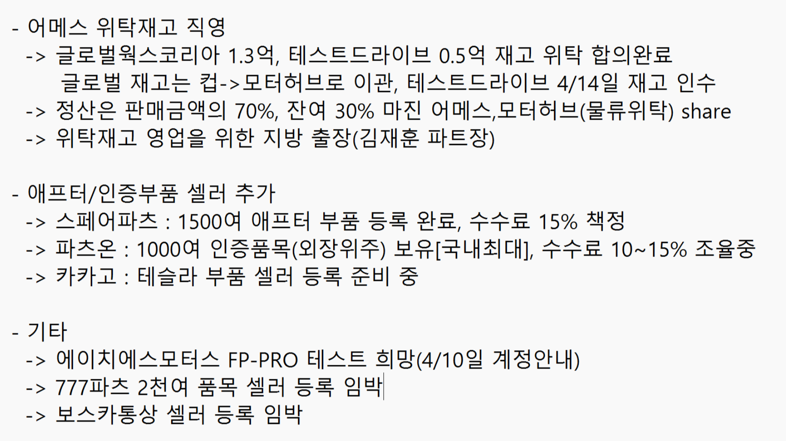
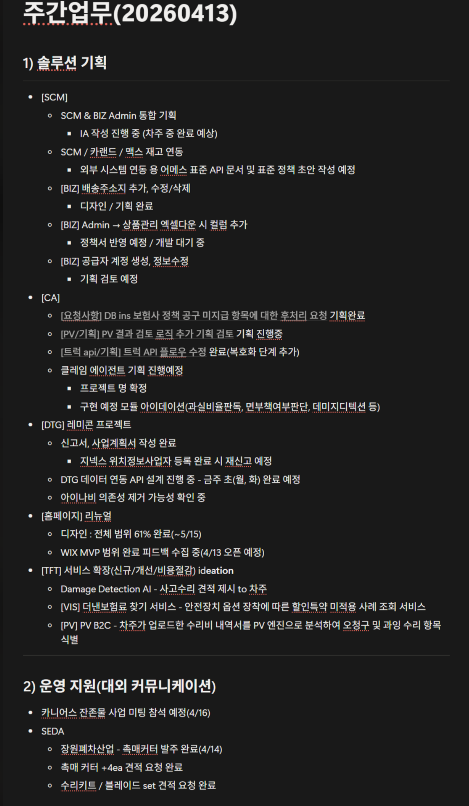
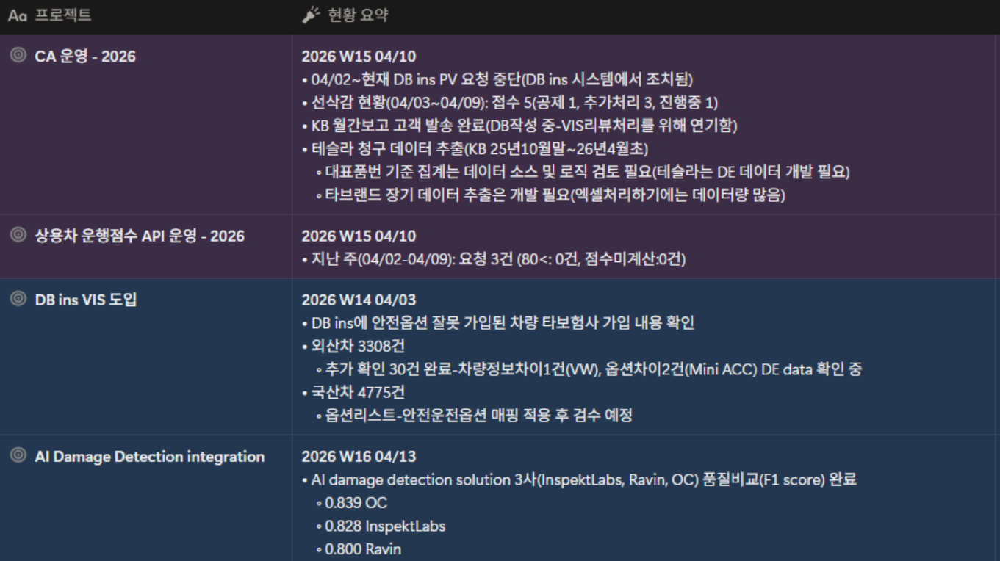
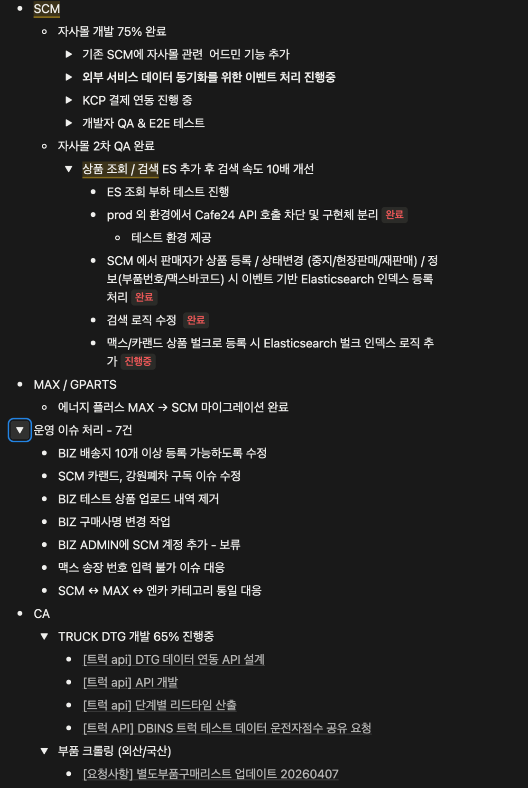

**협력사 및 위탁 재고 운영 현황**

- 재고 인수 및 관리
	- 글로벌웍스 코리아(인천)의 재고 1.35억을 인수 완료 및 수수료 1.5% 책정
		- 테스트 드라이브와 5천만 원 규모의 재고 위탁에 합의
	- 2026.04.14. (화) 재고 인수 계획
	- 위탁 재고의 정산은 판매금액의 70% 진행
- 신규 셀러 입점 현황
	- 스페어파츠: 1,500개 품목의 정품 부품 등록을 완료 및 수수료 15% 책정
	- 파츠온: 약 1,000개의 인증 품목을 보유 중, 수수료 10\~15% 조율 중
	- 카카고: 테슬라 부품 셀러 등록 준비 중
- 기존 업체 협력 사항
	- 에이치에스 모터스 FP pro 테스트 희망
		- 2026.04.10. (금) 계정 안내

**SCM 자사몰 및 시스템 개발 진행 상황**

- SCM 자사몰 개발
	- 개발 진행률은 약 75%
		- 어드민 기능 추가
		- 외부 서비스 데이터 동기화
		- KCP 결제(카드, 가상계좌) 연동 테스트 완료
	- 2차 QA 완료
		- Elastic Search 적용으로 검색 속도가 약 10배 개선
- 기타 개발 현황
	- DTG(트럭) 개발 약 65% 진행
	- 부품 크롤링 작업 완료
	- 에너지플러스 Max → SCM 마이그레이션 완료
	- 운영 이슈 7건 처리 완료

**기획 및 디자인 진행 상황**

- SCM 및 BIZ
	- SCM과 BIZ 업로드 통합 기획 진행 중
		- 2026.04. 3주차 중 IA 작성 완료 예정
	- 외부 시스템 연동을 위한 표준 API 문서 유무 확인 및 없을 시 제작 요청 예정
	- BIZ 어드민 배송지 관리 기능 디자인 및 기획 완료
- CA 및 트럭 API
	- 보험사 미지급 공구 항목 후처리 기능 개발 기획 완료
	- PV 결과 검토 로직 추가 기획 중
	- Truck API Flow 수정 및 DTG 업체 데이터 추가 완료
	- 클레임 에이전트 프로젝트명은 클라라 확정, 내부 모듈 아이디어를 구상 중
- DTG 프로젝트
	- 지넥스 측에 위치정보사업자 등록을 재요청
- 클로드 사용량 조회 기능
	- 전체 사용자의 클로드 사용량 확인할 수 있는 기능 개발 요청
- 미팅 및 프로젝트
	- 2026.04.16. (목) 카니언스 잔존물 미팅 참석 예정
	- KB손해보험 및 중국 핑안보험 체결한 계약 프로젝트 참여 예정

**VIS '더 낸 보험료 찾기' 서비스 및 신규 사업 모델 전략 논의**

- 서비스 배경 및 POC 결과
	- 보험사들이 안전관리 특약을 정확히 적용하지 않는다는 가정하에 POC 진행,
	- 국산차 4%, 외산차 8% 특약 누락을 확인
- 사업 방향성 검토
	- 보험사들이 과납 보험료 발생 사실에 부담을 느껴, 손해보험협회 미팅 후 DB손해보험 및 KB손해보험 측서 회신
	- 기존 '더 낸 보험료 찾기' 서비스로 수수료를 취하는 방식을 고려, 보험사에 직접 데이터를 판매하는 방향 검토, 이는 경쟁사 등장 전 가격 협상력을 확보하기 위함
- 비용 및 수익성 분석
	- 보험사들의 연간 피해액은 최대 2,000억 원으로 추산
	- 2,500만 대 데이터 콜 비용(원가 약 1,600억 원)을 보험사에 청구하는 방안 및 DE에 2,500만 건 데이터 처리를 일괄 위탁하는 비용 협상(약 10억 원)을 시도

**DB손해보험 재계약 및 국산차 사업 협의**

- DB손해보험 재계약: 15억 원에 재계약 최종 협의 완료
- 국산차 사업:
	- 국산차에 대해 6개월간 월 15,000건을 무상 제공 제안, 이는 원가 기준 약 1억 8천만 원의 비용 발생
	- 2026.09 무상기간 2026.10 본 계약 전환 목표 및 공임도장 서비스도 연동 예정

**부품 데이터 활용 및 AI 프로젝트 구상**

- 데이터 활용 방안: 청구, 폐차, 부품 구매 데이터를 종합하여 부품 수요를 예측하고 재고 관리에 활용(예: 테슬라 부품 수요 분석)
- AI 프로젝트 구상: 부품 수요 예측 데이터를 기반으로 머신러닝, AI 에이전트 개발 구상 중, 이는 폐차장의 매입 결정 및 부품 판매 마진 설정에 효과

**기타 운영 및 데이터 관련 현안**

- 부품 사업 본부 목표: 올해 수수료 목표 매출은 23억 원, 위탁/협력사 재고, 파츠핏, 키르기스스탄 사업 등을 통해 초과 달성 기대 중
- CA 운영: 2026.04.01. (수)\~ DB손해보험 요청 중단
- 테슬라 청구 데이터: PV 서버 데이터 양이 적어 DB손해보험 측서 조회 시 약 20건이 확인, 수기로 데이터 확보 시 약 한달 소요 예정
- VIS 옵션 비교: 국산차 VIS 옵션 데이터 상이 확인, 비교 후 재작업 진행 예정

**프로젝트성 과제 보상 제도 논의**

- 내용: 정규 업무 외에 회사가 제시하는 프로젝트성 과제를 자발적으로 수행, 성과에 따라 보상하는 제도 논의
- 결론: 직원 아이디어 제안 → 회사 평가 후 보상 다양한 방식을 고려할 수 있으며, 회사를 위해 고민하는 직원들에게 적절한 보상 제공 목표

---

## 첨부 자료

**부품사업본부**

**솔루션기획파트**

**솔루션운영파트**

**연구개발본부**

