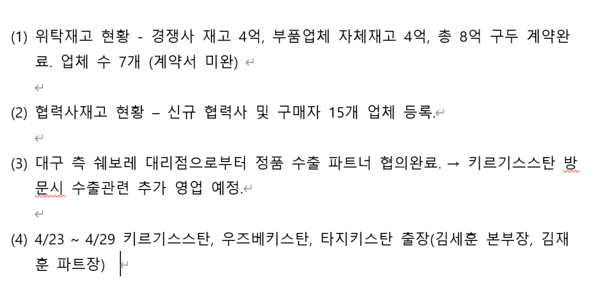
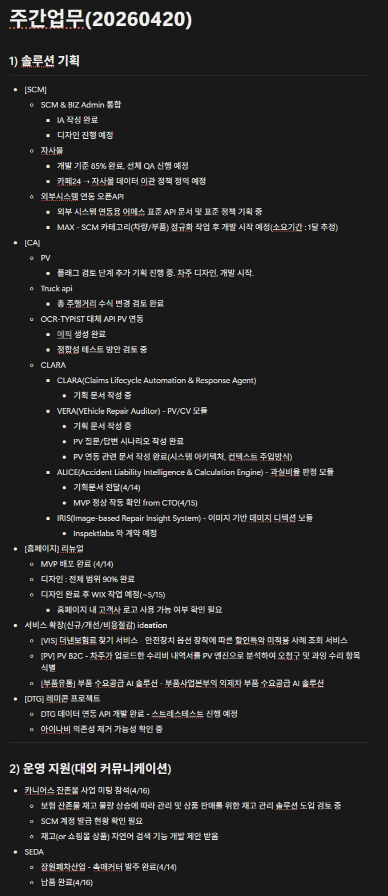
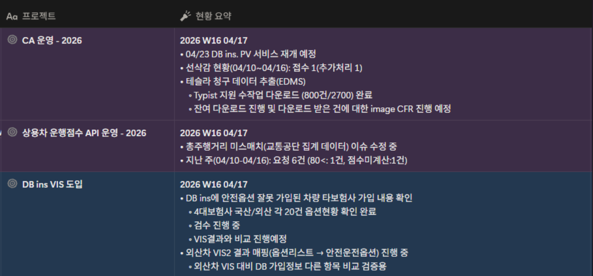
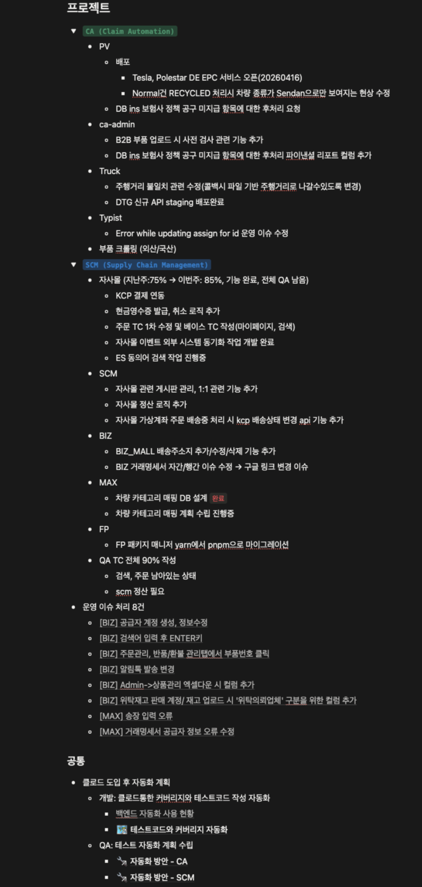

**부품사업본부 진행 상황 공유**

- 물류 및 재고 관리
	- '모터 허브' 물류 외주 위탁 계약 체결 완료
- 수출입 비즈니스 모델 구축
	- 2026.04.23. (수)\~2026.04.29. (수) 키르기스스탄 출장
		- 자동차 부품 수출 가능성 타진 예정
		- 국산/수입, 신품/중고 등 모든 종류의 부품 포함
	- 키르기스스탄, 우즈베키스탄, 타지키스탄 지역 3개국 미팅 예정
	- 출장 후 비즈니스 모델 구체화 내용 공유 예정

**솔루션기획파트 진행 상황 공유**

- SCM 및 자사몰 개발
	- SCM 및 비즈 어드민 통합
		- IA 작성 완료 및 디자인 진행 예정
	- 자사몰 개발 85% 완료, 전체 QA 진행 예정
	- 카페24 → 자사몰 주문·고객 정보 데이터 이관 정책 정의 예정
	- 2026.04.16. (목) 카니어스 잔존물 미팅 진행
		- 해당 업체 재고 관리 솔루션 도입 검토 중
		- SCM 계정 발급 현황 확인 및 적극 어필 필요
- API 개발 및 연동
	- 웹 시스템 연동 오픈 API: 카테고리 정규화 완료 후 개발 시작 예정
	- 트럭 API: 총 주행거리 오류 수식 변경 및 개발 완료
	- OCR 대체 API PV 연동: 기획 완료, 정확성 테스트 방법 검토 중
- 모듈 개발 및 기획
	- CLARA: 기획 문서 검증·작성 중, 향후 모듈 명칭으로 소통 예정
	- ALICE(과실비율 판정 모듈): 기획문서 전달 및 MVP 정상 작동 확인
	- IRIS(이미지 기반 데미지 디텍션 모듈): 'Inspektlabs'과 계약 예정
- 기타 프로젝트
	- 홈페이지 리뉴얼 MVP 배포 완료, 디자인 90% 완료. 윅스 작업 예정
	- 부품 수요공급 AI 솔루션 기획 요청서 접수, 데이터 취급 방안 논의 완료
	- DTG 레미콘 프로젝트 데이터 연동 API 개발 완료, 스트레스 테스트 예정
- SEDA 장비 납품
	- 장원폐차산업 촉매 커터 납품 완료
	- 날 및 스탠드 추가 견적 요청 접수

**솔루션운영파트 진행 상황 공유**

- CA 운영 진행 상황
	- 2026.04.23. (목) DB손해보험 PV 서비스 재개 예정
	- 2026.04. 3주차 선삭감 현황 추가처리 1건 접수
	- 테슬라 청구 데이터 추출(EDMS)
		- 타이피스트 지원으로 수작업 다운로드 2700건 중 800건 진행 중
		- 다운로드 건에 대해 이미지 CFR 진행 예정
- 상용차 API 운영 진행 상황
	- 총주행거리 이슈 수정 중
	- 2026.04. 3주차 6건 요청 접수
- VIS 도입 관련 진행 상황
	- DB손해보험 안전옵션 잘못 가입된 차량 타보험사 가입 내용 확인
		- 4대보험사 국산 및 외산 각 20건 옵션현황 확인 완료
		- 검수 및 비교 진행 예정

**연구개발본부 진행 상황 공유**

- PV 배포 진행 상황
	- 테슬라 및 폴스타 DE EPC 서비스 오픈
	- 노멀건 재활용 처리 시 차량 종류 세단 노출 현상 수정
- CA 진행 상황
	- DB손해보험 보험사 정책 공구 미지급 항목에 대해 후처리 파이낸셜 리포트 컬럼 추가
	- B2B 부품 업로드 시 사전 검사 관련 기능 추가
- 트럭API 진행 상황
	- 주행거리 불일치 관련 수정
	- DTG 신규 API 스테이징 배포 완료
- SCM 및 자사몰 개발 진행 상황
	- 자사몰
		- 개발 85% 완료, 2026.05 전체 QA 진행 예정
		- KCP 결제 연동 및 현금영수증 발급/취소 로직 추가
		- 주문 TC 1차 수정 및 베이스 TC 작성
		- ES 동의어 검색 작업 진행중
	- 자사몰(SCM) 기능 추가
		- 게시판 관리, 정산 로직, 가상계좌 주문 배송중 처리 시 KCP 배송상태 변경 API
	- 파츠핏비즈
		- 거래명세서 자간/행간 이슈 수정 완료
		- 위탁 재고 판매 계정/재고 업로드 시 '위탁의뢰업체' 구분을 위한 컬럼 추가

**경영지원본부 진행 상황 및 VIS 관련 논의**

- 경영지원
	- 1분기 결산 진행 중, 마감 후 투자사 보고 예정
	- 자회사 자본금 증액 관련 이사회 목/금 예정
	- 2026.05.13. 신용보증기금 만기 건 대응 중
- VIS 데이터 판매 전략
	- 보험사들과 각 세우지 않고 데이터를 제값에 판매하는 전략 우선 추진
	- 원활하지 않을 경우 2026.06 혁신 금융 서비스 신청 계획
	- 2026.04.23. (목) KB손해보험과 협의 예정
	- 손해보험협회를 통한 전체 보험사 일괄 계약 방식도 검토
- 사이드 프로젝트 및 성과 보상 논의
	- 개요
		- OCR 타이피스트 대체, 아이나비 연간 수주 대체 등 비용 절감 프로젝트 진행 중
		- 회사 절감 비용의 20%를 기여자에게 성과급으로 지급 예정
	- 운영 방안
		- 프로젝트 기여도에 따라 메이저 기여자/부수적 참여자로 구분해 차등 보상
		- 업무 시간 활용·기여도 산정의 모호함 우려 제기
		- 지향점: 본업에 지장 없이 효율 향상, 기여자 보상
		- 구체적 운영 방안은 추후 논의 예정

---

## 첨부 자료

**부품사업본부**

**솔루션기획파트**

**솔루션운영파트**

**연구개발본부**

