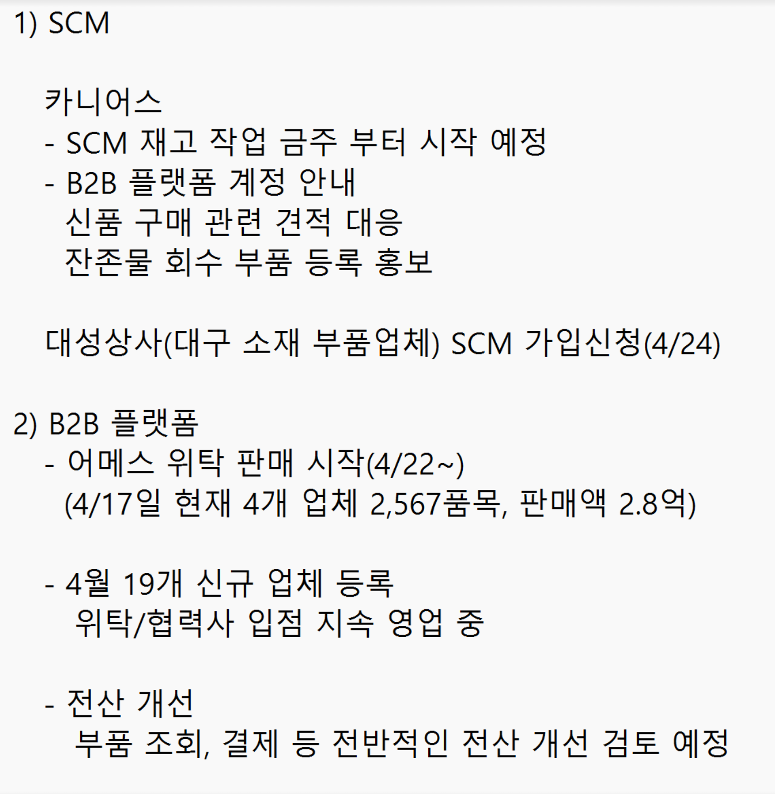
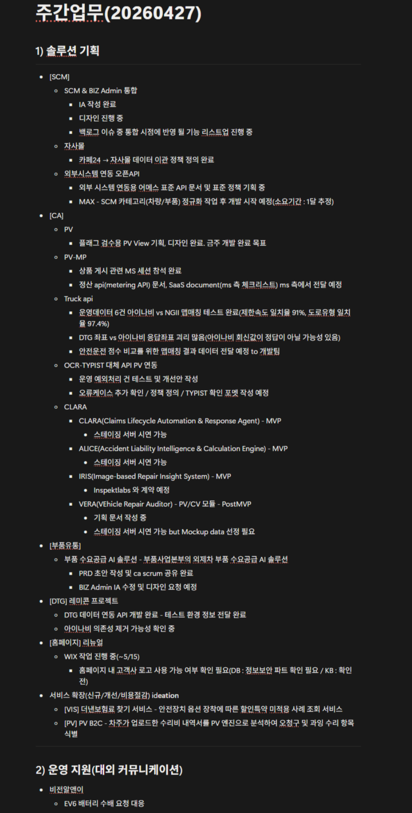
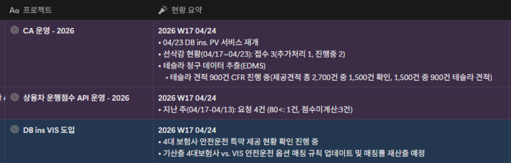
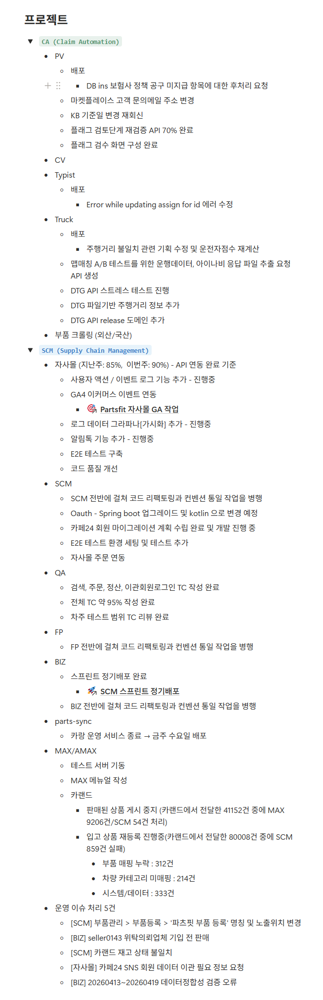

**사업 전략 및 운영**

- VIS 및 보험사 대응 전략
	- 현황:
		- 보험사 측서 VIS 관련하여 시간 끌기 전략을 사용할 것으로 예상, 명확한 대응 논리 준비가 필요
		- 현재 정부의 자동차 보험료 인하 압박으로, 금융위원회 측서 혁신금융서비스 신속히 승인 가능성 높음 판단
	- 대응 방안:
		- 4대 보험사의 공통 항목을 기준으로 데이터 분석
		- 외산차 20%, 국산차 80% 등의 가중 평균치 적용한 결과지 도출
		- 보험사의 요청으로 '더 낸 보험료 찾아드립니다'의 공격적인 문구 대신, 더 우호적인 표현 검토
	- 결론:
		- 2026년 6월 혁신금융서비스 신청 전에 보험사 협상 완료 목표
		- 운영파트 인력 부족 시 부품사업본부 인원을 활용하여 VIS 데이터 비교 작업 신속히 처리 요청
- 복지포인트 변경 운영 방안
	- 배경: 과세 이슈로 복지 제도를 복지포인트 대신 비플식권 및 건강검진 추가
	- 논의 내용: 직원 편의를 위해 식대 사용 시간 제한 완화하여 아침 및 야근, 티타임 등에도 사용 가능 검토
	- 결론: 우선 식대 사용 시간 및 장소 제한을 완화하여 운영하되, 오남용(예: 자택에서 사용) 문제 발생 시 사용 시간, 지역 등을 제한하는 방안 재검토. 최소한의 사용 원칙(회사 바운더리 내 사용)을 지켜줄 것 당부
- 폐차장협회 자사몰 런칭 전략
	- 현황: 협회 자사몰 관련 계약 일정 지연 예정
	- 대응 방안: 일정이 지연될 경우, 자사몰 선 런칭 방향 고려중으로 애프터마켓용 상품 기능 개발 선행 필요
	- 결론: 협회 측 일정 확인 예정
- 부품 사업 및 운영 관련 논의
	- 이베이 인수인계: 김재훈 진행 예정
	- 폐차장 영업 확대: SCM 활용 및 부품사업 직원을 파견하는 등 폐차장 영업 확대 방안에 대한 구체적인 실행 검토 요청
	- 엔진오일 사업: 판매처 확보 방안(정비소 라인 등) 부품사업본부 측서 논의 예정
- 키워드 광고 및 매출 분석:
	- 현황: 월 200만 원의 광고 예산 대비 파츠핏 매출이 3,000만 원대로 감소
	- 논의 내용: 투자자 보고를 위해 지표 하락 원인 분석 필요

**각 파트별 프로젝트 현황**

1. 부품사업본부 현황
	- 파츠핏 SCM 입점 현황
		- 2026.04.27 (월) 카니어스 SCM 재고 작업 진행
		- 대성상사 부품 등록 진행
	- 파츠핏 비즈 입점 현황
		- 2026.04 기준 19개 신규 업체 등록
		- 2026.04.22 (수) 파츠핏 비즈 위탁 판매 진행
			- 4개 업체의 재고 약 2,500 품목 위탁
	- 파츠핏 비즈 개선 작업
		- 부품 조회: 약 86,000개의 부품 대량 조회 기능의 사용성 개선 방안을 추가 논의할 예정입니다.
		- 결제 시스템: 현재 건별 가상계좌 방식의 불편함이 제기되어, 회사 계좌 입금 후 수동 처리하는 방안이 아이디어 차원에서 제시되었습니다. 이는 법적/기술적 검토 후 김태훈 본부장 복귀 시 재검토하기로 했습니다.
2. 솔루션기획파트 현황
	- SCM 및 비즈 어드민 통합:
		- 기획 및 디자인 완료 및 개발 진행 중
		- 통합 시점에 반영할 백로그 이슈 정리 중
	- 자사몰
		- 카페24 → 자사몰 데이터 이관 정책 정의 완료
	- CA 운영 현황
		- PV
			- 플래그 검수형 PV View 페이지 기획 및 디자인 완료
			- 금주 내 개발 완료 목표
	- PB 마켓플레이스
		- 상품 게시 관련 마이크로소프트 세션 기획자 참석 완료
		- 정산 API 문서 등 마이크로소프트 측 전달 예정
	- 트럭 API 품질 테스트
		- 운영 데이터 테스트 결과: 제한속도 일치율 91%, 도로 유형 일치율 97.4%로 운영 이슈 없음 판단
	- OCR 대체
		- 운영 예외 처리 케이스 테스트 및 개선안 작성 중
	- 클라라/앨리스:
		- 스테이징 서버에서 시연 가능
		- 고객사 시연을 위해 데미지 디텍션 기능 추가 후 모바일 구현 검토
		- MVP 단계 기간계 연동 없이 기능 유효성 검증 방안 고려
	- 아이리스
		- Inspektlabs 계약 체결 후 시연 가능토록 추가 개발 예정
	- 베라
		- 스테이징 서버 시연 가능하나 목업 데이터 선정 필요
	- 부품 수요공급 AI 솔루션
		- PRD 초안 작성 완료
	- 홈페이지 리뉴얼
		- 윅스 작업 진행 중
			- 홈페이지 내 고객사 로고 사용 여부 확인 중
	- 부품 수배 요청
		- 비젼알앤이 EV6 대응 중
	- 외부 시스템 연동 및 추가 개발 확인
		- DB손해보험: 국산차 및 공임 도장 일정 확인 필요
		- DE 데이터 개발: 르노 및 GM 진행 필요
3. **솔루션운영파트 현황**
	- CA 운영 현황
		- 2026.04.23 (목) DB손해보험 PV 서비스 재개
		- 2026.04 3주차 기준 선삭감 현황
			- 3건 접수
		- 테슬라 청구 데이터 추출 관련 견적 900건 CFR 진행 중
	- 상용차 운행점수 API 현황
		- 2026.04 3주차 기준 요청 3건 접수
4. 연구개발본부 현황
	- CA 운영 현황
		- PV
			- DB손해보험 정책 공구 미지급 항목 후처리 요청 배포 완료
			- KB손해보험 기준일 변경 처리 완료
		- PV 마켓플레이스: 문의 메일 주소 변경 완료
		- 타이피스트: 어사인 업데이트 발생 오류 수정 배포 완료
		- 트럭API
			- 주행거리 불일치 관련 기획 수정 및 운전자 점수 재계산 배포 완료
			- 맵매칭 A/B 테스트를 위한 운행 데이터 및 아이나비 응답 파일 추출 API 개발 진행
			- DTG 스트레스 테스트 진행 및 파일 기반 주행거리 정보 추가, 릴리즈 도메인 작업 진행
		- 부품 크롤링 진행 중
		- 파츠싱크
			- 2026.04.29 (수) 카랑 운영 서비스 종료 배포 예정
	- SCM 운영 현황
		- 자사몰
			- API 연동 기준 약 90% 완료
			- 현재 사용자 액션 및 이벤트 로그 시각화 및 알림톡 기능 개발 중
			- GA4 이커머스 이벤트 연동 병행 작업 중
			- E2E 테스트 구축 및 코드 리팩도링, 컨벤션 통일 작업 진행 중
			- 카페24 회원 마이그레이션 계획 수립 완료 관련 개발 진행 중
		- FP
			- 코드 리팩토링 및 컨벤션 통일 작업 진행
		- 파츠핏 비즈
			- 스프린트 정기 배포 완료
		- 맥스 및 어맥스
			- 테스트 서버 기능 및 메뉴얼 작성 완료
			- 카랜드 상품 싱크 및 관련 이슈 처리 진행
	- QA 현황
		- 검색, 주문, 정산, 이관 회원 로그인 TC 작성 완료
		- 전체 TC 95% 작성 완료
		- 테스트 범위 TC 리뷰 완료
5. 경영지원본부 현황
	- 2026년 1분기 현황
		- 2026.04.28 (화) 2026년 1분기 결산 마감 예정
		- 1기 부가세 예정 신고 완료 및 납부 예정
	- 자회사 현황
		- 2026.04.23 (목) 자회사 이사회 진행
		- 2026.04.27 (월) 자회사 1차 증자
		- 2026.04.29 (수) 자회사 2차 증자 예정
	- 복리후생 제도
		- 2026.05.01 (금) 도입
			- 비플식권
			- 건강검진
	- 기업부설연구소
		- 2026년도 연구소 안전 관리 실태 조사 진행 예정
	- 조직 문화
		- 회사 원칙 및 11계명 작성 후 포스터 제작 예정
	- 인력 충원
		- 솔루션운영파트 인력 신속히 채용 진행

## 액션 아이템

**\[솔루션 기획파트\]**

1. DB손해보험 공임/도장 시스템 연동 + 국산차 PV 진행 관련 DB손해보험회의 재개최 (박원재, 조병일, 심재훈)
2. 르노/GM 데이터 개발 (유럽·미국 동시)
3. 테슬라/폴스타 데이터 릴리즈 → 고객사 공유 (퀄리티 체크 후)
4. Clara/Alice 모바일 웹 시연 가능성 검토
5. OCR 타입리스트 운영 예외 케이스 정책 정의 + 포맷 작성
6. 부품 수요공급 AI 솔루션 PRD → Biz Admin IA 수정/디자인 요청
7. 홈페이지 고객사 로고 사용 가능 여부 확인 (DB손해보험 및 KB손해보험)
8. SCM ↔️ B2B Admin 통합 (백로그 이슈 리스트업)
9. 폐차장 협회 자사몰 확정 시 추가 진행 여부 확인
10. 이베이 진행 (운영 → 기획 이관)

**\[솔루션 운영파트\]**

1. VIS 안전관리특약 매칭 (4대 보험사 공통항목 기준 정리) - 6월 혁신금융서비스 신청 전
2. VIS: 3년/5년/10년치 기준별 피해 금액 추산 - 6월 신청 전
3. VIS: '더 낸 보험료 찾기' 워딩 친화적으로 재네이밍
4. PV B2C 민원 공격 대상 선정 (삼성·현대)
5. 솔루션운영파트 인력 채용 (절대 기준 낮춰서 충원) - 시급
6. DB손해보험 선삭감 프로세스 변경 운영 정비

**\[부품사업본부\]**

1. 대성공사(대구) SCM 등록 → 상품 등록 모니터링
2. 위탁판매 운영 (4개 업체 약 2,500개, 판매가 1.8억) 확대
3. 부품조회 화면 개선 (8.6만 SKU 다건 조회 편의성)
4. 가상계좌 → 도매업체식 계좌 결제 변경 검토 - 김세훈 출장 복귀 후
5. 이베이 인수인계- 김재훈
6. 폐차장 추가 영업 확대 - 시급
7. 엔진오일 사업타당성 검토

**\[연구개발본부\]**

1. DB 공임/도장 시스템 연동
2. DB 선공제 프로세스 변경 시스템 수정
3. 트록 API 맵매칭 결과 → 아이리스 포맷 매칭 → 개발팀 전달 → 안전운전 점수 산출
4. 르노/GM/테슬라/폴스타 데이터 개발 + 릴리즈
5. DTG 스트레스 테스트 + 파일 기반 주행거리 정보 추가 + 릴리즈 도메인 작업
6. 레미콘 프로젝트: 지넥스 테스트 환경 정보 전달 완료 → 아이나비 의존성 제거 가능성 확인
7. 자사몰: 카페24 → 자사몰 데이터 이관 정책 종료 후 마이그레이션 개발
8. 플래그 재검증 API (70%) + 검수화면 마무리
9. 주행거리 불일치 기획 수정 + 운전자 중심 체계 배포 후 모니터링
10. 맵매칭 A/B 테스트용 운행 데이터
11. Amax 테스트 서버 + 메뉴얼 + 카랜드 상품 싱크 이슈 처리
12. 파츠싱크 카랑 운영 서버 종료 (2026.04.29 (수))
13. QA TC 작성 (전체 95% → 완료)

**\[경영지원본부\]**

1. 복지포인트 → 비플식권 + 건강검진
2. 복지포인트 사용 시간/지역 제한 정책 - 일단 오픈, 문제 발생 시 제한
3. 솔루션운영파트 채용 기준 완화 (절대 기준 낮춰서 진행) - 시급
4. 법률 질의 전체 팔로우업
5. 회사 원칙 + 11계명 포스터 제작

---

## 첨부 자료

**\[부품사업본부\]**

**\[솔루션기획파트\]**

**\[솔루션운영파트\]**

**\[연구개발본부\]**

