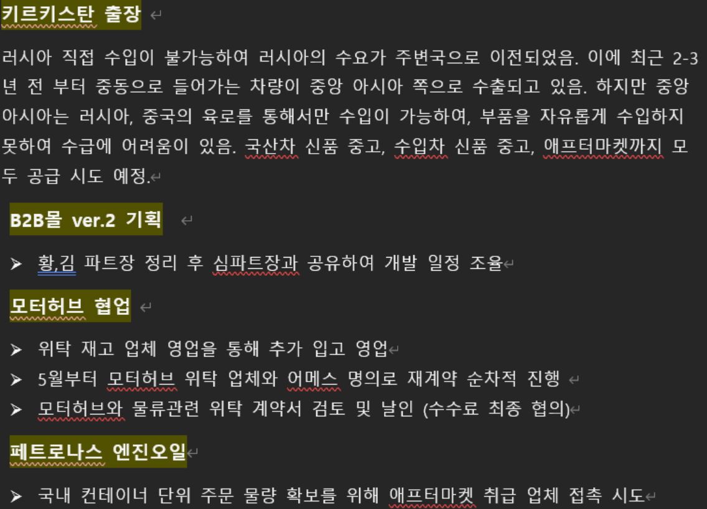
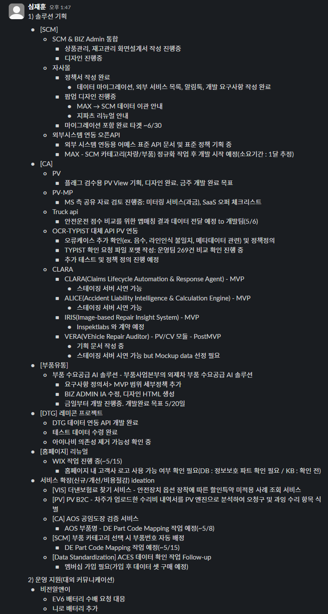
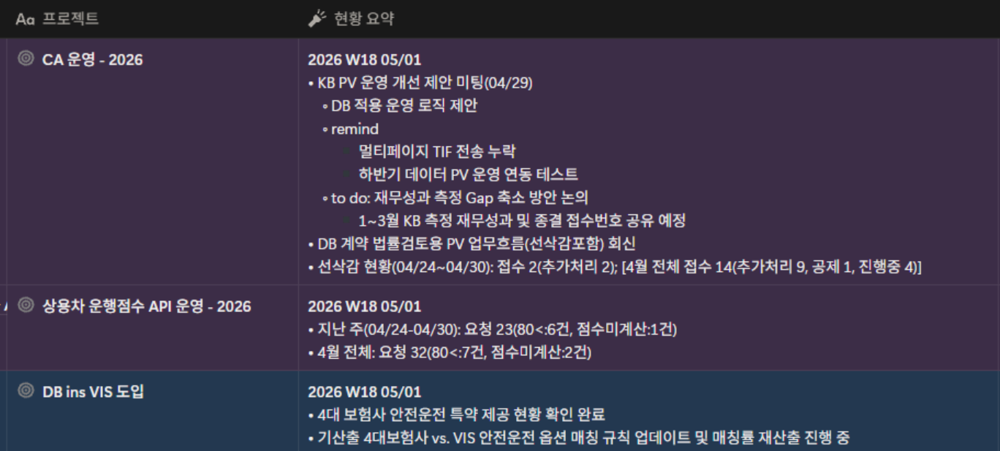
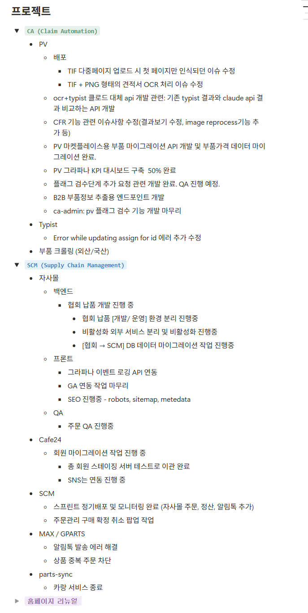

## 부품사업본부

- 키르기스스탄 출장
	- 중고 부품 및 차량 수출 등 다양한 비즈니스 모델 검토 완료
		- 중고 부품에 대한 현지 니즈 가장 높음
	- 공급업체 세팅 및 폐차장 미팅 진행 예정
- 모터허브 및 컵 위탁 관련
	- 모터허브: 위탁 재고 이관 작업 지속 및 수수료율 협의 예정
	- 컵: 재고 회수 방안 및 영업 전략 구체화 예정
- 유통 및 파츠핏 진행 현황
	- 페트로나스 엔진오일: 컨테이너 베이스 수입을 위해 애프터카멧 취급 업체 및 바이어 확인 중
	- 이베이: 2026.05. 2주차 중 인수인계 완료 예정
	- 동강그린모터스:
		- 파츠핏 입점 의사 확인 완료
		- 소송 리스크가 있는 업체로 입점계약서 법률 검토 진행 필요

---

## 솔루션기획파트

- SCM 및 자사몰 고도화
	- SCM/비즈 어드민 통합: 상품 및 재고 관리 화면 설계서 작성 중
	- 자사몰
		- 정책서 작성 완료
		- 데이터 마이그레이션 및 외부 서비스 개발 요구사항 정리 완료
		- 안내 및 디자인: 맥스 데이터 이관 및 지파츠 리뉴얼 관련 팝업 디자인 진행 중
		- 타겟 일정: 2026.06. 말
- CA
	- OCR 대체 API
		- 오류 케이스 개선 작업 진행 중
		- 비교 검증을 위한 템플릿 전달하여 테스트 및 정교화 진행 예정
- 부품 유통
	- 트럭 API: 2026.05.06 (수) 맵 매칭 결과 데이터 공유 미팅 예정
	- 레미콘 프로젝트:
		- 데이터 전송 테스트 완료
		- 스트레스 테스트를 위한 수량 및 건수 요청 대기 중
		- 아이나비 호출 없이 자체 웹 서비스 대체 방안 검토 중
- 서비스 확장 아이데이션
	- AOS 공임도장 검증:
		- DE 부품 코드 및 AOS 부품명 매핑 테스트 결과 긍정적
		- 매핑 테이블 작성 후 1차 전달 예정
	- 부품 카테고리 선택시 부품번호 자동 배정
		- 2026.05.15. (금) 매핑 작업 병행하여 검토 예정
	- ACES 데이터 확인: 멤버십 가입 절차 재개 및 데이터셋 구매 예정

---

## 솔루션운영파트

- KB손해보험 협업 및 운영 개선
	- 시스템 및 룰 적용 제안
		- 현황: DB손해보험에 적용 중인 운영 룰 KB손해보험 동일 적용 제안
		- 결과: KB손해보험 담당자 측서 각 항목별 도입 여부 및 검토 중
		- 재무성과 조정
			- 현재 KB손해보험 측정 성과와 실제 데이터 차이가 있어 보고 할 시 어려움 발생
			- 2026.01.\~03. 종결 건 접수 번호를 기반으로 성과 데이터 재산출하여 조정 방향 논의
	- 선공제 및 시스템 구성
		- 선공제: DB손해보험 사례 참고하여 담당자 재량권을 부여하는 방식에 대해 인지하고 있으니, KB손해보험 측은 시스템상 구현 가능성에 대해 회의적
		- 리스크 관리: 해당 업무가 손해사정으로 해석될 소지에 대해 우려가 여전
- DB손해보험 운영 현황
	- 선삭감 현황
		- 2026.04. 전체 접수 14건 (추가 처리 9건/공제 1건/진행중 4건)
	- 트럭 API
		- 2026.04. 전체 접수 32건
	- VIS 도입
		- 4대 보험사 안전운전 특야 제공 현황 확인 완료
		- 삼성화재 이슈: FCW(전방충돌경고) 및 AEB(자동비상제동) 명확하게 구분이 안되어 있어 계산 시 케이스별 정리 후 보고 예정

---

## 연구개발본부

- CA
	- 파일 인식 이슈: tif 다중 페이지 업로드 시 첫 페이지만 인식 랜덤 이슈 수정 완료
	- OCR 처리: tif 및 png 형태의 견적서 OCR 처리 이슈 수정 및 배포 완료
	- CFR 기능: 관련 이슈 사항 수정 완료
	- API 대체: OCR 및 타이피스트 업무 클로드 대체 API 개발 진행 중
	- 마켓플레이스: 마이그레이션 API 개발 및 부품 가격 데이터 마이그레이션 완료
	- 대시보드: PV 그라파나 KPI 대시보드 구축 진행
	- 타이피스트 에러 사항 수정 완
- 자사몰
	- 협회 납품용 개발 사이트 구죽 진행 중
	- 카페24 기반 회원 데이터 이관 코드 작업 및 테스트 이관 완료
		- 자사몰 오픈 시점에 맞춰 즉시 이행 가능하도록 준비 완료
	- 자사몰 주문 및 정산 작업에 필요한 로직 추가 및 배포
	- 알림톡 시스템 추가 배포
- 지파츠 및 맥스
	- 알림톡 시스템 발송 에러 해결
	- 상품 중복 주문 차단 로직 추가
- 파츠싱크
	- 카랑 서비스 종료

---

## 경영지원본부

- 재무 및 법무
	- 1분기 결산 진행 완료
	- 월 결산 업무 효율 고려하여 진행 여부 재협의
	- 다함손해사정 증자 등기 완료
	- 비상무 이사 선임 절차 진행 중
	- 우리은행 신용조사 대응 진행 중
- 혁신금융서비스 신청
	- 한국핀테크산업협회 컨설팅 및 신청서 양식 준비 중
	- 솔루션기획파트 및 연구개발본부 협업 필요
- 복리후생 제도
	- 비플 식권: 신규 도입에 따른 사용 안내 완료
	- 건강검진: 하나로의료재단 선정

---

## 첨부 자료

**\[부품사업본부\]**

**\[솔루션기획파트\]**

**\[솔루션운영파트\]**

**\[연구개발본부\]**

