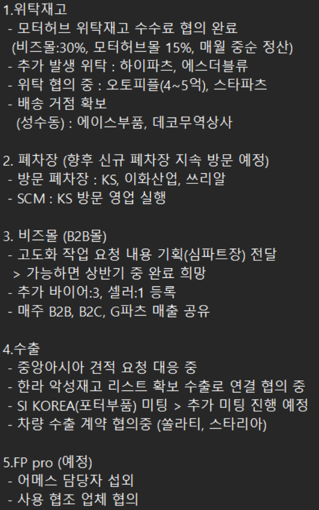
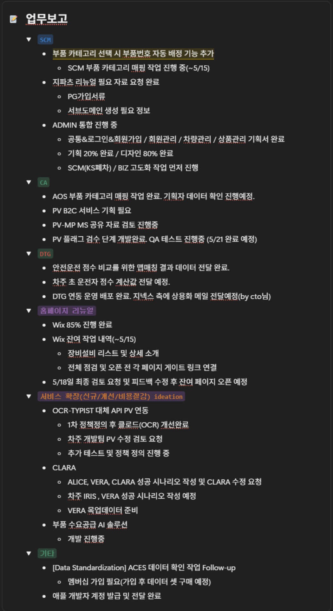
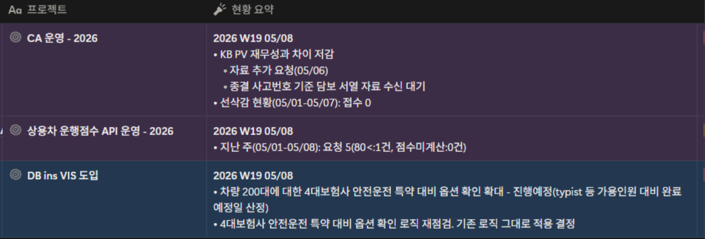
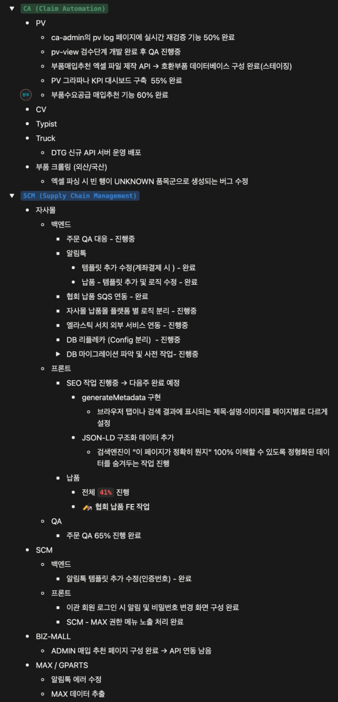

## 부품사업본부

- 테슬라 부품 데이터베이스구축
	- 현재 OEM 공급이 어려운 상태
	- 결정 사항: 수작업 품번 데이터 추출 중단없이 계속 진행
	- 사유: 중국 등 해외 소싱 및 리스트 작성을 위한 필수 작업
- 비즈몰 고도화 상반기 희망
	- 모터허브에서 판매되는 월 6\~7천 건의 주문이 당사로 넘어오지 못하는 사유가 기술적 장애 요소 확인
	- 향후 계획: 기능 고도화 완료 시, 기존 모터허브 자체 몰 폐쇄 후 비즈몰 운영 예정
- FP Pro (외주 견적 시스템)
	- 서비스 방향: 현장 사고차 견적 대행하는 외주 견적 시스템
	- 실무 검증: 내부 직원 채용 후 당사 Sdk 활용 방식 및 기존 진행 방식 비교 분석
	- 수익 모델: 내년 유료화 목표. 한라 및 SK 등과 연계하여 재고 조회 기능까지 탑재하여 견적 건당 수수료 모델 검토
- 모터허브 회계 처리 방안
	- 정산 주기: 월 2회 진행 협의
	- 결제 방식: KCP가 아닌 회사 직접 계좌 입금 방식 적용
	- 모터허브 매출 정산
		- 현재 모터허브 전산상 당사 매출 약 1,100만원 발생
		- 당사에서 해당 매출 리스트 전달 시, 모터허브 측에서 확인 후 세금계산서 발행 방식 처리
	- 수수료: 15% 수수료 적용
		- 당월 중순 '수수료 계정 코드' 신설하여 시스템 등록 예정

---

## 솔루션기획파트

- 비즈몰 요청 사항
	- 비즈몰 관련 요청사항 10건에 대해 우선 순위 확정하여 지라 이슈 생성 요청 완료
- 애플 개발자 계정
	- 생성 사유: 보험사와의 '5부제 할인' 관련 앱 개발 가능성 대비하여 선제적으로 생성 완료
- 지파츠 리뉴얼
	- KCP 심사 진행 현황: 협회 측 내용 전달 완료. 현재 협회 내부 사정으로 대기 상태로 지속적으로 팔로업 예정

---

## 솔루션운영파트

---

## 연구개발본부

---

## 경영지원본부

- 혁신금융서비스: 신청 완료 및 컨설팅 일정 조율 예정
	- 컨설팅 일정: 2026.05.21 (목) \~ 2026.05.29 (금)
- 법인 등기: 비상무이사 선임 관련 이사회 및 임시 주주총회 준비
- 다함손해사정 확장: 대전 및 부산 지점 설립 절차 진행 중
